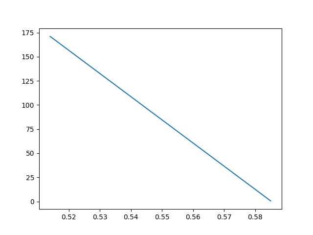

spotify-stats

Project to learn Pandas and matplotlib

Mathplotliv is a comprehensive library for creating static, animated, and interactive visualizations in Python. Pandas is an open source data analysis and manipulation tool, built on top of the Python programming language.

Created a simple plot with two values from the dataset

